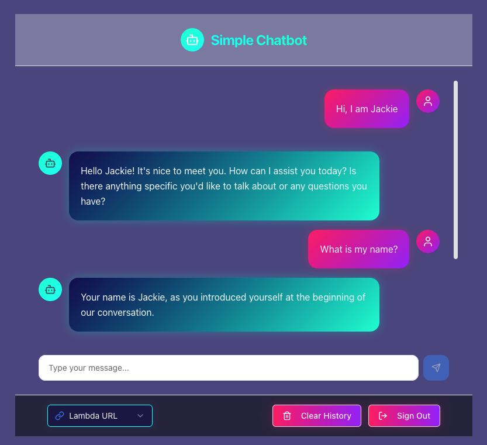
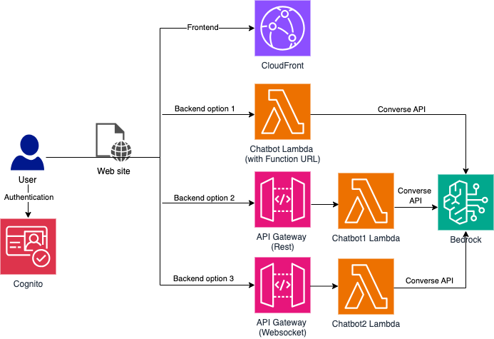

# Simple Chatbot

## Description

Simple Chatbot is a sample project to demonstrate how to build a Chatbot with AWS serverless architecture.

The frontend is written in React and deployed to CloudFront with Cognito authentication.

The backend has 3 options:

- Lambda function URL (with streaming support)
- API Gateway (Rest API) + Lambda
- API Gateway (Websocket API) + Lambda (with streaming support)

Lambda uses Converse API to interact with LLM models in Bedrock.

The conversation history is stored in browser local storage for simplicity.

## CI/CD

This project uses GitHub Actions for continuous integration:

- **CDK Tests**: Automatically runs tests for the CDK infrastructure code on push
- **Frontend CI**: Lints and builds the frontend React application on push
- **Main Workflow**: Comprehensive workflow that runs both CDK tests and frontend build



## Architecture



## Usage

### Customization

Go to [simple-chatbot.ts](./cdk/bin/simple-chatbot.ts) and update the settings accordinly:

```javascript
const props = {
  appName: process.env.APP_NAME || "SimpleChatbot",
  allowedDomain: process.env.ALLOWED_DOMAIN || "amazon.com", // Allowed email domain in Cognito
  region: process.env.REGION || "ap-southeast-2",
  bedrockRegion: process.env.BEDROCK_REGION || "ap-southeast-2",
  modelId:
    process.env.MODEL_ID || "apac.anthropic.claude-3-5-sonnet-20240620-v1:0",
};
```

### Create stack

```bash
cd cdk
npm install
cdk deploy
```

### Destroy stack

```bash
cd cdk
cdk destroy
```

## Demo

[](https://youtu.be/5PUlrJ-w2RM)
